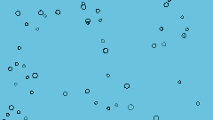
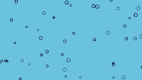
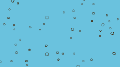
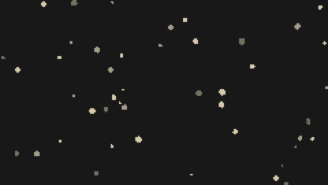
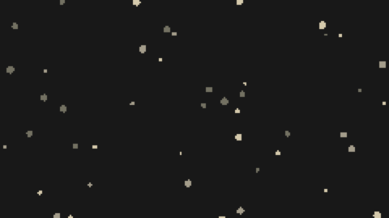
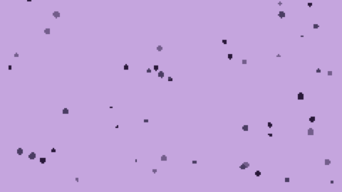

# Rill World

A generative environment box, a companion to [Rill](https://github.com/bruceblay/rill-synth), for the **M5Stack StickS3**. Rill World plays real field recordings, grouped into banks (Rain, Birds, more to come), through a slow bar-synced filter sweep and a handful of self-clearing effects, so it breathes rather than sitting as a flat loop. Tap for a new recording within the current bank. Shake for a different bank entirely.

It is a sibling instrument, not a Rill feature: same hardware, same GPL-3.0-or-later license and Rill's parent project Pocket Radio, and built with the same host-testable, allocation-free approach, but its own repository, its own engine, and its own aesthetic. It needs no Wi-Fi, account, or cloud service.

## Play

| Gesture | Action |
| --- | --- |
| Front button: tap | Pick a new recording and character within the current bank, change the visual, and play |
| Front button: hold for about 0.65 seconds | Fade sound out or in; the loop continues while quiet |
| Side button: tap | Cycle volume and show the data view for four seconds |
| Shake | Cross into a different bank -- a different environment, a different visual palette and drift |

The data view shows the current bank, recording, generation, tempo, bar count, volume and battery estimate.

## What it is

An earlier version generated its own noise from scratch (filtered white noise standing in for water/rain/wind), in the spirit of a vintage sound conditioner like the Marsona 1200. That synthesis was rejected by ear as universally bad, the same conclusion reached about Rill Drums' own procedural noise voices, so this project pivoted to real recordings instead, and later broadened from a single rain-only device into multiple selectable environments:

- **Five banks so far**: **Rain** (six surfaces -- umbrella, puddle, concrete, terrace, plastic tarpaulin, metal wheelbarrow -- a steady wash through to increasingly percussive and metallic), **Birds** (forest ambience, dawn chorus, evening birds), **Insects** (nocturnal insects, crickets/frogs meadow, a close field cricket, a lone night grasshopper), **Ocean** (two wave textures, one underwater hydrophone recording of a waterfall), and **Cave** (two digitally-composited drip/reverb ambiences). All placeholders pending original field recordings (see [docs/SOURCES.md](docs/SOURCES.md) for sources and licenses -- all CC0). Adding a further bank is data, not a rewrite -- see `src/Field.h`. A cicada clip in Insects and a whole Body bank (heartbeat, breathing) were both tried and dropped: the cicada read as off-putting, and Body just wasn't interesting. Ocean's third clip took several tries -- a humpback whale song read as too weak, a bottlenose dolphin's clicks were unpleasant on a loop, and a Weddell seal trill was tuned but never shipped once its license turned out unverified -- before landing on the underwater recording. A standalone Storm/Cave idea was floated and narrowed down after a raw preview: kept Cave (didn't read as "more water"), skipped a separate Storm bank.
- **A bar-synced lowpass sweep** stands in for a vintage sound conditioner's Tone/Surf Rate knobs: narrow range, low resonance, slow enough to read as breathing rather than the main event. Its floor is kept above ~700 Hz -- the StickS3's small speaker barely reproduces anything lower (confirmed by Rill Drums' own on-device measurements), so a sweep that dips below that reads as silence, not warmth.
- **Five punch-in effects** -- Pitch Wobble, Delay Throw, Crush, Reverb, Smear -- one at a time, semi-random, self-clearing after a bar or two, each evolving across its own window rather than sitting at one flat setting. Same direction as Rill Drums' punch-in effects. Magnitude varies per bank: Birds and Insects run the biggest, wobbliest Delay Throws/Smears and the widest Pitch Wobble range, Cave shares their delay/smear intensity, with Ocean and Rain gentler. Delay Throw uses 40–75 ms taps; Smear uses 25–60 ms taps with slight modulation. Delay Throw peaks at 70–85% feedback for an intense short tail; Smear retains gentler 25–35% feedback.

Device-to-device ensemble sync -- so a Rill World unit could lock its sweep and bar clock to another Rill instrument's shared tempo -- follows the same unimplemented [design proposal](https://github.com/bruceblay/rill-synth/blob/main/SYNC-DESIGN.md) as Rill and Rill Drums; nothing here talks to another device yet. The bar clock is already shaped to receive that later without restructuring.

Cave plays its two 3-second recordings at 65% speed by default: about 4.6 seconds per loop and 7.5 semitones lower. Pitch Wobble works relative to that slower baseline.

Playback state is not saved across restarts.

## On the device

The visual is one continuous particle field per bank, not a catalog of families like Rill's or Rill Drums' -- this project's focus is the audio, and the screen only needs to read as alive. A bar boundary briefly brightens a particle near the top, a visible tell for the rhythm that's otherwise only in the audio's filter sweep. Rain forms tiny expanding pond ripples that fade and reappear at new impact points; Cave keeps falling dots. Birds are tiny two-stroke chevrons that flap as they wander; Insects have little bodies and four fluttering wings, independently alternating between brief hovers, sudden darts, and longer curving flights with fresh directions and durations; Ocean has hollow bubbles drifting slowly upward. Tap cycles the ink color within a bank; shake crosses to the other bank's ground, ink set, drift and shape entirely.

Color follows the same drawing language as Rill and Rill Drums -- flat opaque ink, a fainter particle mixed toward the ground colour rather than toward black, regardless of which one is lighter. The ground colour is fixed per bank rather than shuffling -- it's how you tell banks apart at a glance: Rain is the only dark ground (moody charcoal-blue with pale ink, since it suits rain at night); Birds, Insects, Ocean and Cave all invert that with light grounds and dark ink -- sky-blue for Birds, green for Insects, a lighter turquoise for Ocean, a light purple for Cave. Cave's ground started dark like Rain's and was changed after feedback that it needed a more distinctive look.

**Rain** (expanding pond ripples, dark charcoal-blue ground)

| | | |
| --- | --- | --- |
|  |  |  |

**Birds** (flapping chevrons, light sky-blue ground)

| | | |
| --- | --- | --- |
|  |  |  |

**Insects** (fluttering insects, light green ground)

| | | |
| --- | --- | --- |
|  |  |  |

**Ocean** (hollow bubbles drifting upward, lighter turquoise ground)

| | | |
| --- | --- | --- |
|  |  |  |

**Cave** (falling dots, light purple ground)

| | | |
| --- | --- | --- |
|  |  |  |

These are host-rendered previews (`tools/visual_preview.cpp`), pixel-identical to what the firmware pushes to the real screen, not photos of the device -- the animation and bar-tick highlight don't show in a still frame.

## Hardware

Supported and tested: **M5Stack StickS3**, with ESP32-S3, 8 MB flash, display, IMU and built-in speaker. Other ESP32 boards and earlier M5Stick models are not supported by this configuration.

The PlatformIO board name is `esp32-s3-devkitc-1`; the project supplies the StickS3 memory settings and uses M5Unified for board peripherals. Flash is partitioned as a single factory app slot (`partitions_field.csv`), not the usual two-slot OTA layout, so the embedded clips fit -- this device is flashed by USB each time, not updated over the air. The partition has been grown twice now (~7 MB, then ~7.6 MB, now ~7.87 MB) to fit Insects' and then Cave's clips, and sits at ~99.6% full (~30 KB free) -- this is the practical ceiling on an 8 MB chip. Anything more will need to trim or drop an existing clip rather than grow further.

## Build and install

Install Python 3.11 or later, then run these commands from the repository root:

```sh
python3 -m venv .venv
source .venv/bin/activate
python -m pip install -r requirements-dev.txt
pio run
```

On Windows, activate with `.venv\Scripts\activate` instead. PlatformIO downloads the pinned platform and library dependencies on the first build.

Connect the StickS3 with a USB data cable, locate its port with `pio device list`, then install:

```sh
python tools/flash.py --port YOUR_DEVICE_PORT
```

Flashing replaces the firmware currently on the device. The script builds and uploads, then applies the watchdog reset used successfully during Rill's development; a normal RTS reset can leave this board in download mode.

To observe diagnostics:

```sh
pio device monitor --port YOUR_DEVICE_PORT --baud 115200
```

Close the monitor before another upload.

## Develop without hardware

Host tools use the same C++ engine and visual code as the firmware. A C++17 compiler is required.

```sh
python tools/test.py
mkdir -p build
c++ -std=c++17 -O2 tools/render.cpp -o build/render
build/render build/rain.wav 60 42
c++ -std=c++17 -O2 tools/visual_preview.cpp -o build/visual_preview
build/visual_preview build/preview.ppm 23 0
```

The audio arguments are output path, seconds, and optional seed. The visual arguments are output path, seed, and optional regenerate-once flag. Audio output is mono 32 kHz / 16-bit WAV; visual output is PPM. For host address/undefined-behavior checks, run `python tools/test.py --sanitize` with a compatible compiler. Set `CXX` to choose a compiler.

`tools/embed_samples.py` converts mono 16-bit 32 kHz WAV loops into `src/Samples.h`; see that file's docstring and [docs/SOURCES.md](docs/SOURCES.md) before replacing or adding a clip.

Tests cover five simulated minutes of playback per seed, bounded output, a jump/discontinuity bound across crossfades and the loop point, seed reproducibility, per-bank texture coverage, that tap never crosses a bank boundary and shake always can, fade/resume, and shake gesture recognition. They do not replace listening or checking the physical screen.

## Project layout

- `src/Field.h` -- sample playback, bank ranges, bar-synced sweep and punch-in effects
- `src/Samples.h` -- generated PCM data; see `tools/embed_samples.py`
- `src/Weather.h` -- the ambient particle visual, one palette set and drift kind per bank
- `src/main.cpp` -- audio, display, buttons and motion tasks
- `src/ShakeDetector.h` -- gesture recognition, shared with Rill
- `tools/` -- portable tests, auditions, previews, sample embedding and flashing
- `tests/` -- host verification
- `docs/SOURCES.md` -- source recordings and licenses for the embedded clips

## Credits and license

In the spirit of [Rill](https://github.com/bruceblay/rill-synth). Developed through iterative on-device listening and viewing, with Claude assisting implementation.

Rill World follows Rill's parent project Pocket Radio's **GPL-3.0-or-later** license. See [LICENSE](LICENSE). The embedded field recordings are separately licensed CC0 1.0; see [docs/SOURCES.md](docs/SOURCES.md).

Shake draws from a shuffled bank pool, visiting every bank before refilling it. Recordings within each bank also cycle through a shuffled pool; neither pool repeats its last choice at a refill. Rain uses 24 slowly expanding ripples, while Ocean and Cave drift at a calmer pace.
